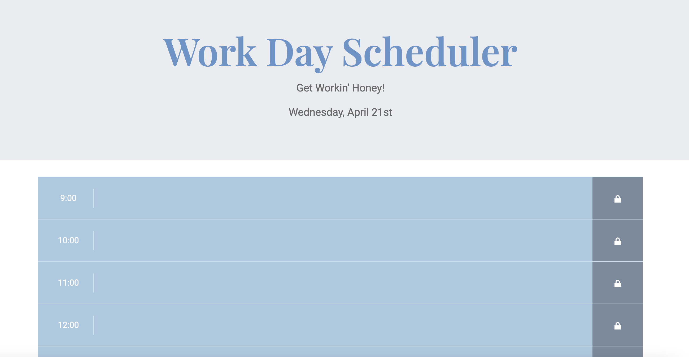

# Work Day Scheduler

## Description 

This week I was challenged with creating a simple application that allows a user to save events each hour of the day. 

Overall this was an interesting project, and I could really understand it's real world application.

## Site Location

[Site Location](https://abbycav7.github.io/work-day-scheduler/)

## Site Image

